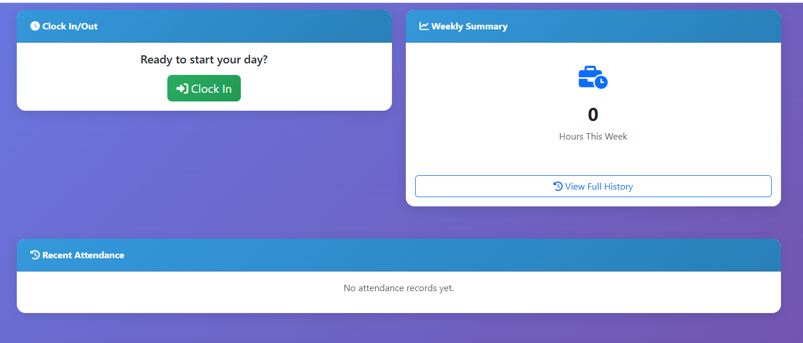

# Secure Time & Attendance Management System (TAMS)

## Overview

The Secure Time & Attendance Management System (TAMS) is a Flask-based web application developed as a bachelor's thesis project focused on secure attendance tracking, access control, and administrative monitoring.

The system was designed with security-focused features including role-based access control (RBAC), multi-factor authentication (MFA/TOTP), audit logging, IP-based attendance tracking, authentication workflows, and administrative monitoring capabilities.

This project demonstrates practical implementation of authentication security, user access management, accountability controls, and secure system design concepts within a web-based information system.

===

## Security Features

- Multi-Factor Authentication (MFA/TOTP)
- Role-Based Access Control (RBAC)
- Password Hashing & Authentication Security
- Audit Logging & Administrative Monitoring
- Login Attempt Tracking
- IP-Based Attendance Validation
- Session Security Controls
- Password Reset Functionality
- Administrative Access Restrictions

===

## System Features

### Employee Features
- Secure login system
- Attendance clock in/out
- Leave request submission
- Attendance history tracking
- MFA enrollment and verification

### Administrative Features
- User management
- Attendance monitoring
- Audit log review
- Leave approval workflows
- Administrative reporting

===

## Technologies Used

### Backend
- Python
- Flask
- SQLAlchemy

### Database
- SQLite

### Frontend
- HTML
- CSS
- Bootstrap

### Security & Authentication
- Flask-Login
- PyOTP
- QR Code MFA Setup

### Development Tools
- Git
- VS Code

===

## Security Concepts Applied

- Authentication & Authorization
- Principle of Least Privilege
- Role Separation
- Auditability & Accountability
- Secure Session Management
- Credential Protection
- Access Monitoring
- Security Logging
- Multi-Factor Authentication

===

## Testing

The project includes functional and security-oriented testing for:
- Authentication workflows
- Access control validation
- Attendance tracking
- Administrative functions
- MFA functionality
- User authorization checks

===


## Screenshots

### Employee Dashboard




## Local Installation

### Clone Repository
```bash
git clone https://github.com/Palviny/secure-time-attendance-system.git
```

### Create Virtual Environment
```bash
python -m venv venv
```

### Activate Environment (Windows)
```powershell
venv\Scripts\activate
```

### Install Dependencies
```bash
pip install -r requirements.txt
```

### Initialize Database
```bash
python update_db.py
```

### Create Admin User
```bash
python create_admin.py
```

### Run Application
```bash
python app.py
```

===

## Future Improvements

- Cloud deployment support
- Enhanced reporting and analytics
- Role-based permission granularity
- Centralized logging integration
- Security alerting and monitoring
- Docker containerization

---

## Author

Developed by Anne Palviny as part of a Bachelor's Degree project in Information Systems & Cybersecurity.